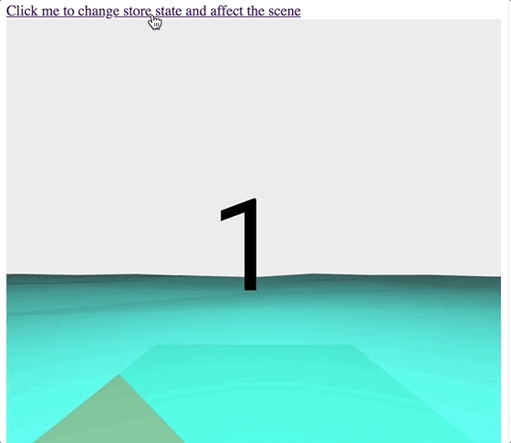

# A-Frame + Redux

At [Olio Apps](http://www.olioapps.com/), we are applying tools and practices from our experience creating React and React Native applications to engineering VR software for the web.  

## Installation 

### npm
```javascript
npm install --save aframe-typescript-redux
// or yarn add aframe-typescript-redux
```
```javascript
import * as AframeRedux from "aframe-typescript-redux"
```

### cdn

```html
<!-- index.html -->
...
    <script 
        type="text/javascript"
        src="https://cdn.jsdelivr.net/npm/aframe-typescript-redux@0.0.7/dist-umd/vendor.bundle.min.js">
    </script>
    <script
        type="text/javascript"
        src="https://cdn.jsdelivr.net/npm/aframe-typescript-redux@0.0.7/dist-umd/index.min.js">
    </script>
</head>
```

## Redux Connected Aframe Component Example

We will be discussing the [complete example](examples/connected_component.html) below. You can also play with a live example in action at [https://codesandbox.io/s/o71qm45xy](https://codesandbox.io/s/o71qm45xy).

[](https://codesandbox.io/s/o71qm45xy)

To summarize, we will be doing the following:
1. adding `aframe-typescript-redux` to an a-frame project
2. defining a `Redux Store`
3. instantiating `ReduxConnectedSystem` and connecting it to this redux store
4. creating an AFrame entity that is redux-connected
5. defining `my-component` and adding listeners for redux store changes
6. defining an `onClick` function in order to dispatch a redux action

## 1. Add Aframe-Typescript-Redux to your project
To connect your aframe component to redux, the following packages are required: `a-frame`, `aframe-typescript-redux`, and `redux`. In this example, we use the cdns for each and include the scripts in the head of our `html` file .
```html
<html>
    <head>
        <!-- a-frame -->
        <script src="https://aframe.io/releases/0.8.0/aframe.min.js"></script>
        
        <!--  aframe-typescript-redux -->
        <script type="text/javascript" src="https://cdn.jsdelivr.net/npm/aframe-typescript-redux@0.0.7/dist-umd/vendor.bundle.min.js"></script>
        <script type="text/javascript" src="https://cdn.jsdelivr.net/npm/aframe-typescript-redux@0.0.7/dist-umd/index.min.js"></script>
        
        <!--  redux -->
        <script type="text/javascript" src="https://cdnjs.cloudflare.com/ajax/libs/redux/4.0.0/redux.js">
```

## 2. Define a Redux Store

Defining a simple redux store involves at least 3 main pieces:

- the shape of the store,
- the root reducer,
- any action(s) for altering the store.

After these three pieces are in place, the store itself can be created.

```javascript
// define shape of store
const initialState = {
    count: 1
}

// define actions
const doAdd = () => ({ type: "DO_ADD" })

// define root reducer
const reducer = (state = initialState, action) => {
    switch (action.type) {
        case "DO_ADD":
            return { count: state.count + 1 }
        default:
            return state
    }
}

// finally, create the store with the root reducer
const store = Redux.createStore(reducer)
```

In the example above, dispatching the `doAdd` action will increment the store's `count` it holds by one:

```javascript
console.log(store.getState()) // { count: 1 }

store.dispatch(doAdd()) // dispatch doAdd to the store

console.log(store.getState()) // { count: 2 }
```

See [Redux documentation](https://redux.js.org/basics/actions) for more details.

## 3. Instantiate `ReduxConnectedSystem` and Connect It To The Redux Store

```javascript
// create a new instance of AframeRedux.ReduxConnectedSystem,
// pass in the just created store, then register it
const system = new AframeRedux.ReduxConnectedSystem(store).register()
```

Instantiating a `ReduxConnectedSystem` and supplying your redux store will cause store changes to be forwarded to entities bound to the `redux-connected` component.

## 4. Create a `redux-connected` AFrame Entity

Below is the html to create an aframe `a-text` entity which is given a component `my-component`, and is also redux connected via `redux-connected`:

```html
<a-text my-component redux-connected="count: count"
    color="black"
    position="0 2 -5">
</a-text>
```

Defining `redux-connected="count: count"` causes the entity to be notified of changes to the `count` property in the store, via an event of the name `count`.

## 5. Define `my-component` and add listeners for store changes

The component `my-component` is defined as follows:

```javascript
AFRAME.registerComponent("my-component", {
    init: function() {
        this.el.addEventListener("count", function(event) {
            const score = event.detail.newState
            this.setAttribute("value", score)
        })
    }
})
```

In the `init` function, AFRAME creates an instance of `my-component` and attaches it to the entity. At this point we can attach a listener to the element (`this.el`) to listen for events called `count`, which will be forwarded by `ReduxConnectedSystem` to the event handler whenever the `count` property in state changes.  

Alternatively, the watched redux store property could have been specified using the `watchedKeys` property on the entity component:

```html
<a-text my-component redux-connected="watchedKeys: count"
...
```

When `watchedKeys` is used, the event listened to by the target component (`my-component` in these examples) is assumed to have the same name as the watched redux property. Multiple redux store keys/events can be specified, eg. `watchedKey: prop1,prop2,prop3`.

## 6. Define `onClick` to dispatch actions

The button click handler dispatches `doAdd` to the store when it is clicked, causing the store to change state, and in turn `ReduxConnectedSystem` notifies any entities listening to changes to the `count` property.

```javascript
// define click handler
const onClick = () => {
    store.dispatch(doAdd())
}
```

We defined a simple button outside of the scene to hold the click handler. When the button is clicked, the `a-text` entity within the scene increments itself.

```html
// create an html button holding the new onClick function
<a onclick="javascript:onClick()" id="clickMe" href="#">Click Me</a>
```

## Contact
We are interested in hearing your questions and feedback.

Email: [vr@olioapps.com](vr@olioapps.com)

## Additional Reading 
- [redux](https://redux.js.org/)
- [aframe](https://aframe.io/)
- [aframe-typescript-toolkit](https://github.com/olioapps/aframe-typescript-toolkit)
## License
This program is free software and is distributed under an MIT License.